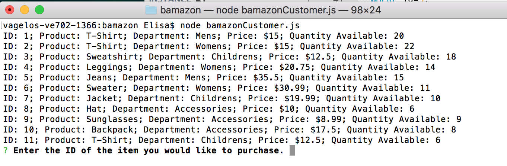
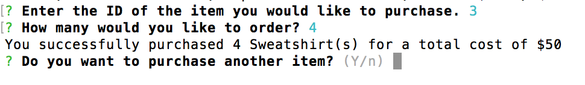
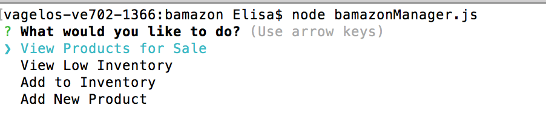
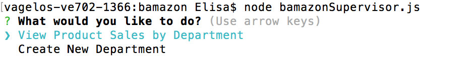
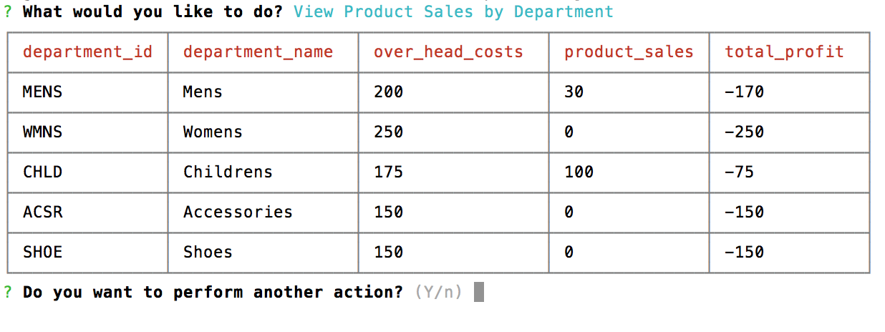

# bamazon

## A command line shopping interface utilizing Node JS and MySQL

## Customer View
Upon starting the app you will get a list of all available items and the information for each.

Enter the ID of the item you would like to purchase. If there is not enough of that item in stock then you will be prompted to start over. If there are then your purchase will be complete.

## Manager View
Managers have the capability to view inventory status, update inventory totals, and add new items to stock.

## Supervisor View
Supervisors have the capability to view entire departments, their profitability, and add new departments to the store.

